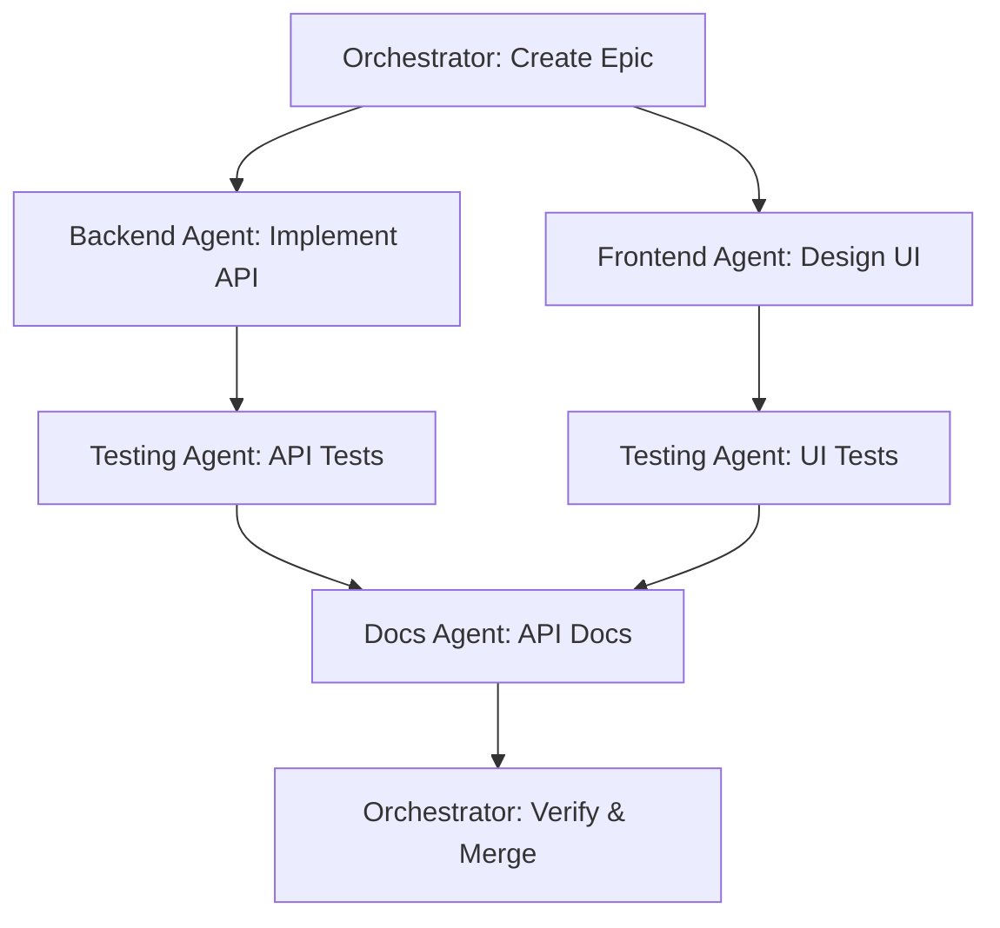

# 🤖 Agent Workflows – BlackRoad OS

This document defines patterns for orchestrating AI agents across BlackRoad OS services and repositories.

## Overview 🎯

BlackRoad OS is designed to support **10,000 agents + 1 human** operating in harmony. This requires clear patterns for how agents discover work, collaborate, and avoid conflicts.

## Core Principles 🧠

### 1. Agents are Autonomous
- Agents discover and claim work independently
- No central dispatcher (distributed coordination)
- Agents communicate via shared state (GitHub Issues, Projects)

### 2. Agents Follow Conventions
- Same branch naming as humans
- Same PR process as humans
- Same review requirements as humans

### 3. Agents Avoid Conflicts
- Check for existing work before starting
- Use atomic operations (GitHub Issues, PRs)
- Gracefully handle race conditions

### 4. Agents are Observable
- All actions logged (commits, PRs, comments)
- Agent identity clear (bot account or [bot] tag)
- Work traceable to originating task

## Agent Types 🤖

### Code Generation Agents
**Purpose:** Write code based on specifications

**Input:**
- GitHub Issue with specification
- Design document
- API contract

**Output:**
- Pull Request with implementation
- Tests
- Documentation

**Example workflow:**
1. Agent polls for issues with `Status: Ready` + `Team: API` + `Agent: Available`
2. Agent claims issue (adds `Agent: In Progress`, assigns self)
3. Agent creates branch: `feature/api-<issue-number>-<description>`
4. Agent implements feature
5. Agent opens PR, links issue
6. Agent requests review from CODEOWNERS
7. Human reviews and merges

### Code Review Agents
**Purpose:** Review PRs for code quality, security, style

**Input:**
- Pull Request

**Output:**
- Review comments
- Approval or request changes

**Example workflow:**
1. Agent monitors for new PRs (webhook or polling)
2. Agent analyzes code changes
3. Agent posts review comments
4. Agent approves (if all checks pass) or requests changes
5. Human makes final decision on merge

### Testing Agents
**Purpose:** Generate and run tests

**Input:**
- Code changes (PR)
- Test specifications

**Output:**
- Test files
- Test results
- Coverage reports

**Example workflow:**
1. PR opened
2. Testing agent triggered via GitHub Action
3. Agent generates missing tests
4. Agent runs full test suite
5. Agent posts results as PR comment
6. Agent commits generated tests to PR branch

### Documentation Agents
**Purpose:** Write and update documentation

**Input:**
- Code changes
- API specifications
- User stories

**Output:**
- Markdown documentation
- API reference
- Tutorials

**Example workflow:**
1. Code merged to main
2. Documentation agent detects changes
3. Agent updates relevant docs
4. Agent opens PR: `docs/<area>-update-for-<feature>`
5. Agent requests review from docs team

### Monitoring Agents
**Purpose:** Detect and triage incidents

**Input:**
- Logs, metrics, alerts
- Error reports

**Output:**
- GitHub Issues for incidents
- Triage labels
- Initial investigation notes

**Example workflow:**
1. Error rate spike detected
2. Monitoring agent creates issue: `[incident] High error rate in /agents endpoint`
3. Agent adds labels: `Type: Bug`, `Priority: High`, `Team: API`
4. Agent pings on-call engineer
5. Human takes over incident response

### Orchestrator Agents
**Purpose:** Coordinate multi-step workflows

**Input:**
- High-level goals
- Task dependencies

**Output:**
- Multiple GitHub Issues
- Task assignments
- Progress tracking

**Example workflow:**
1. Human creates epic: "Implement agent workflow system"
2. Orchestrator breaks down into tasks:
   - Issue 1: Design API endpoints
   - Issue 2: Implement backend
   - Issue 3: Add tests
   - Issue 4: Update documentation
3. Orchestrator assigns to specialized agents
4. Orchestrator tracks progress
5. Orchestrator reports completion

## Agent Coordination Patterns 🕸️

### Pattern 1: Work Queue (GitHub Issues)

**Concept:** Issues act as work queue

**Implementation:**
```python
# Agent discovers available work
issues = github.search_issues(
    query='is:issue is:open label:"Status: Ready" label:"Agent: Available"'
)

for issue in issues:
    # Try to claim (race condition handled by GitHub)
    try:
        issue.add_labels(["Agent: In Progress"])
        issue.add_assignees(["agent-bot"])
        # Do work...
    except ConflictError:
        # Another agent claimed it
        continue
```

**Labels used:**
- `Status: Ready` – Ready for agent pickup
- `Status: In Progress` – Agent is working on it
- `Agent: Available` – Suitable for automated agents
- `Agent: Human Required` – Needs human intervention

### Pattern 2: Event-Driven (GitHub Actions)

**Concept:** Agents triggered by events

**Implementation:**
```yaml
# .github/workflows/agent-trigger.yml
name: Trigger Agent

on:
  issues:
    types: [labeled]
  pull_request:
    types: [opened, synchronize]

jobs:
  dispatch-agent:
    if: contains(github.event.issue.labels.*.name, 'Agent: Available')
    runs-on: ubuntu-latest
    steps:
      - name: Trigger agent service
        run: |
          curl -X POST https://agents.blackroad.io/api/dispatch \
            -H "Authorization: Bearer ${{ secrets.AGENT_API_KEY }}" \
            -d '{"issue": "${{ github.event.issue.number }}"}'
```

### Pattern 3: Polling (Scheduled)

**Concept:** Agents poll for work on schedule

**Implementation:**
```yaml
# .github/workflows/agent-poll.yml
name: Agent Poll

on:
  schedule:
    - cron: '*/15 * * * *'  # Every 15 minutes

jobs:
  poll-work:
    runs-on: ubuntu-latest
    steps:
      - name: Trigger polling agent
        run: |
          curl -X POST https://agents.blackroad.io/api/poll
```

### Pattern 4: Distributed Consensus (Project Boards)

**Concept:** Agents coordinate via GitHub Projects

**Implementation:**
- Agent reads project board state
- Agent identifies next priority task
- Agent atomically claims task (move to "In Progress")
- Agent completes task
- Agent updates status (move to "Done")

**Project fields:**
- **Status:** New, Ready, In Progress, Review, Done
- **Assignee:** Agent or human
- **Priority:** High, Medium, Low
- **Agent Type:** Code Gen, Review, Testing, Docs, etc.

## Agent Communication 💬

### Via GitHub Comments

**Standard format:**
```markdown
🤖 **Agent Update** – [Agent Name]

**Status:** In Progress
**Progress:** 3/5 tasks completed
**ETA:** ~15 minutes

**Details:**
- ✅ Created branch `feature/api-agent-123`
- ✅ Implemented core logic
- ✅ Added unit tests
- 🔄 Running integration tests...
- ⏳ Writing documentation

**Next:** Will request review when tests pass
```

### Via Labels

**Agent-specific labels:**
- `Agent: Available` – Can be automated
- `Agent: In Progress` – Agent working on it
- `Agent: Blocked` – Agent needs help
- `Agent: Human Required` – Escalate to human

### Via Project Fields

**Custom fields:**
- **Agent Owner:** Which agent is responsible
- **Agent Status:** Current agent state
- **Agent Last Updated:** Timestamp

## Multi-Agent Workflows 🌐

### Example: Full-Stack Feature

**Goal:** Add new API endpoint + frontend

**Agents involved:**
1. **Orchestrator Agent** – Coordinates
2. **Backend Agent** – API implementation
3. **Frontend Agent** – UI implementation
4. **Testing Agent** – Tests
5. **Docs Agent** – Documentation

**Workflow:**



**Detailed steps:**

1. **Orchestrator creates issues:**
   - Issue #100: Implement `/agents/workflow` endpoint (Backend)
   - Issue #101: Add workflow UI page (Frontend)
   - Issue #102: Add integration tests (Testing)
   - Issue #103: Update API documentation (Docs)

2. **Backend agent (Issue #100):**
   - Claims issue
   - Creates branch: `feature/api-100-workflow-endpoint`
   - Implements endpoint
   - Opens PR #200
   - Links to Issue #100

3. **Frontend agent (Issue #101):**
   - Waits for PR #200 to be reviewable
   - Claims issue
   - Creates branch: `feature/web-101-workflow-ui`
   - Implements UI (calls new API)
   - Opens PR #201
   - Links to Issue #101

4. **Testing agent (Issue #102):**
   - Monitors PRs #200, #201
   - Generates integration tests
   - Opens PR #202 with tests
   - Links to Issue #102

5. **Docs agent (Issue #103):**
   - Reads API code from PR #200
   - Generates API documentation
   - Opens PR #203
   - Links to Issue #103

6. **Orchestrator monitors:**
   - All PRs open: #200, #201, #202, #203
   - All PRs pass CI
   - Human reviews and approves
   - Orchestrator verifies epic completion

## Agent Safety & Guardrails 🛡️

### Rate Limiting
- **Per agent:** Max 10 issues/hour, 5 PRs/hour
- **Global:** Max 100 agent PRs/day across org
- Prevents runaway agents

### Approval Requirements
- Agent PRs require human review
- Cannot merge own PRs
- Cannot approve own PRs

### Sandbox Testing
- Agents test in sandboxed environments
- Never directly modify production
- Always create PRs

### Rollback Capability
- All agent changes tracked
- Easy to revert agent PRs
- Audit log of all agent actions

### Circuit Breakers
- If agent error rate > 50%, pause agent
- If agent creates >10 failed PRs, disable agent
- Human can re-enable after review

## Agent Monitoring 📊

### Metrics to Track

**Productivity:**
- Issues claimed per hour
- PRs opened per day
- PR merge rate
- Time to complete tasks

**Quality:**
- CI pass rate
- Review cycles per PR
- Bugs introduced
- Code coverage

**Efficiency:**
- CPU/memory usage
- API rate limit usage
- Cost per task

### Dashboards

**Agent Health Dashboard:**
- Active agents
- Tasks in progress
- Error rates
- Resource usage

**Agent Performance Dashboard:**
- Tasks completed today/week/month
- Average task duration
- Success rate
- Top performing agents

## Agent Development Workflow 🔧

### Creating a New Agent

1. **Define purpose** – What does this agent do?
2. **Design interface** – How does it receive input? What does it output?
3. **Implement logic** – Code the agent
4. **Add tests** – Test agent behavior
5. **Deploy to staging** – Test in safe environment
6. **Monitor** – Ensure agent behaves correctly
7. **Deploy to production** – Enable for real work

### Agent Versioning

Agents have versions:
- `agent-code-gen-v1.0.0`
- `agent-code-gen-v1.1.0`

Track versions in:
- Agent commits/PRs (via bot account)
- Labels: `Agent Version: v1.0.0`
- Project fields

### Agent Updates

When updating agent logic:
1. Deploy new version alongside old
2. Gradually shift traffic to new version
3. Monitor for issues
4. Fully cutover if successful
5. Deprecate old version

## Example Agent Implementations 💻

### Python Agent (GitHub API)

```python
from github import Github
import time

class CodeGenAgent:
    def __init__(self, token):
        self.github = Github(token)
        self.repo = self.github.get_repo("BlackRoad-OS/blackroad-os-api")
    
    def poll_for_work(self):
        """Poll for available issues"""
        issues = self.repo.get_issues(
            state='open',
            labels=['Status: Ready', 'Agent: Available', 'Team: API']
        )
        return list(issues)
    
    def claim_issue(self, issue):
        """Claim an issue"""
        issue.add_to_labels("Agent: In Progress")
        issue.add_to_assignees("agent-code-gen-bot")
        issue.create_comment("🤖 Agent claimed this issue. Working on it now...")
    
    def create_branch(self, issue):
        """Create feature branch"""
        base = self.repo.get_branch("main")
        branch_name = f"feature/api-{issue.number}-{issue.title[:30].lower().replace(' ', '-')}"
        self.repo.create_git_ref(f"refs/heads/{branch_name}", base.commit.sha)
        return branch_name
    
    def implement_feature(self, issue):
        """Implement the feature (simplified)"""
        # ... actual implementation logic ...
        pass
    
    def open_pr(self, issue, branch_name):
        """Open pull request"""
        pr = self.repo.create_pull(
            title=f"[api] {issue.title}",
            body=f"Closes #{issue.number}\n\nImplemented by agent.",
            head=branch_name,
            base="main"
        )
        pr.create_review_request(reviewers=["human-reviewer"])
        return pr
    
    def run(self):
        """Main agent loop"""
        while True:
            issues = self.poll_for_work()
            for issue in issues[:1]:  # Process one at a time
                try:
                    self.claim_issue(issue)
                    branch = self.create_branch(issue)
                    self.implement_feature(issue)
                    pr = self.open_pr(issue, branch)
                    print(f"✅ Created PR #{pr.number} for issue #{issue.number}")
                except Exception as e:
                    print(f"❌ Error processing issue #{issue.number}: {e}")
                    issue.create_comment(f"🤖 Agent encountered error: {e}")
            
            time.sleep(900)  # Wait 15 minutes

if __name__ == "__main__":
    agent = CodeGenAgent(token="ghp_...")
    agent.run()
```

### GitHub Action Agent (Workflow)

```yaml
name: Code Review Agent

on:
  pull_request:
    types: [opened, synchronize]

jobs:
  review:
    runs-on: ubuntu-latest
    steps:
      - name: Checkout PR
        uses: actions/checkout@v4
        with:
          fetch-depth: 0
      
      - name: Setup Python
        uses: actions/setup-python@v4
        with:
          python-version: '3.11'
      
      - name: Install review tools
        run: |
          pip install ruff bandit safety
      
      - name: Run code analysis
        id: analysis
        run: |
          # Linting
          ruff check . --output-format=json > ruff-results.json || true
          
          # Security checks
          bandit -r . -f json > bandit-results.json || true
          
          echo "analysis_complete=true" >> $GITHUB_OUTPUT
      
      - name: Post review comments
        uses: actions/github-script@v7
        with:
          script: |
            const fs = require('fs');
            const ruffResults = JSON.parse(fs.readFileSync('ruff-results.json', 'utf8'));
            
            let body = '🤖 **Automated Code Review**\n\n';
            
            if (ruffResults.length === 0) {
              body += '✅ No linting issues found\n';
            } else {
              body += '⚠️ Linting issues found:\n';
              ruffResults.forEach(issue => {
                body += `- ${issue.filename}:${issue.location.row}: ${issue.message}\n`;
              });
            }
            
            // Post as PR comment
            github.rest.issues.createComment({
              owner: context.repo.owner,
              repo: context.repo.repo,
              issue_number: context.issue.number,
              body: body
            });
```

## Agent Best Practices ✅

### DO ✅
- Follow all human conventions (branches, PRs, commits)
- Add clear agent identifier (🤖 emoji, "Agent" prefix)
- Provide detailed progress updates
- Handle errors gracefully
- Request human review
- Respect rate limits
- Log all actions

### DON'T ❌
- Merge own PRs without approval
- Modify code outside assigned task
- Ignore CI failures
- Create branches directly on main
- Bypass security checks
- Run without monitoring
- Commit secrets

---

**Related docs:**
- [Coding Workflow](./coding-workflow.md)
- [Project Management](../projects/blackroad-os-master-orchestration.md)
- [Branch Conventions](../conventions/branches.md)
